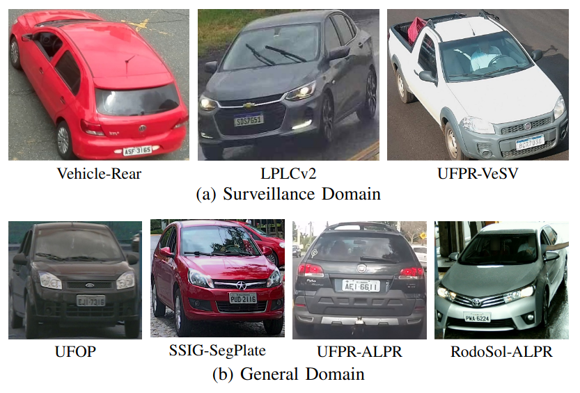
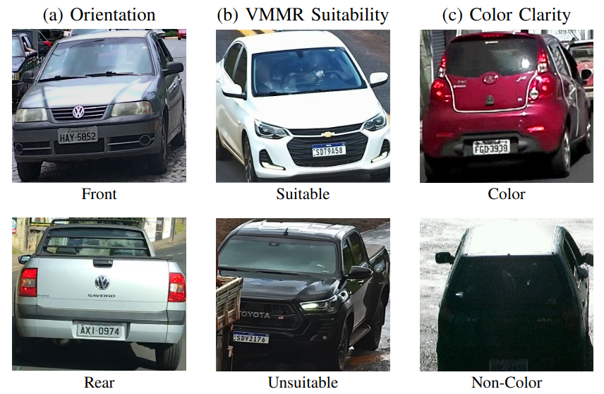

# Unconstrained Vehicle Identification Benchmark (UVIB)

The **UVIB** is a unified benchmark composed of 84,835 vehicle images aggregated from seven public Brazilian datasets, with annotations for three operational vehicle-analysis tasks. The construction and initial results from experiments utilizing four representative deep archiectures under four evaluation protocols (including strict cross-domain settings) are detailed in our paper A Benchmark for Vehicle Attribute Classification
in Cross-Domain Surveillance Scenarios. [PDF](https://arxiv.org/pdf/2609.01584).

# # About

The benchmark is organized into two acquisition domains to support explicit domain-transfer analyses. The Surveillance Domain contains 57,798 images from fixed traffic-monitoring cameras, while the General Domain contains 27,037 images collected under more heterogeneous viewpoints, environments, and acquisition setups.
The Surveillance Domain includes Vehicle-Rear, LPLCv2, and UFPR-VeSV. The General Domain includes UFOP, SSIG-SegPlate, UFPR-ALPR and RodoSol-ALPR. These dataset were selected because they are widely used in Brazilian vehicle and ALPR research, cover diverse illumination and viewpoint conditions, and provide a realistic basis for studying dataset shift. Representative crops from each source are shown in Fig. 1.



Each vehicle crop receives three independent binary annotations. Orientation indicates whether the vehicle is observed from the front or rear. VMMR Suitability captures whether the crop provides sufficient visual evidence formake and model analysis. Color clarity indicates whether chromatic information is visually reliable for downstream vehicle analysis. Examples of these annotations are shown in Fig. 2.




To evaluate classification performance and generalization, four protocols were defined. These protocols distinguish mixed-domain evaluation from stricter transfer settings:
- Surveillance to General (S2G): models are trained and validated strictly on highway surveillance camera data and tested on the remaining datasets from the general domain;
- General to Surveillance (G2S): training and validation occur on the general image subsets, whereas testing is performed exclusively on images captured by highway surveillance cameras;
- All-Datasets: all vehicle crops are pooled and partitioned with stratified train, validation and test splits;
- Cross-Dataset Shift (CDS): designed to distinguish domain-level variations from dataset-specific biases by providing a mix of both Surveillance and General scenarios in both the training and evaluation phases.
The cross-domain protocols (S2G and G2S) use a 60/40 training-validation split within the source domain and the full target domain for testing, with no vehicle-identity overlap between domains. Only 94 shared identities were found between LPLCv2 and UFPR-VeSV, both within the Surveillance domain. The CDS protocol uses the same 60/40 split, with these 94 shared identities representing less than 0.15% of the test set. For all three protocols, target datasets are completely withheld during training and validation.
The All-Datasets protocol uses a stratified 60/20/20 split for training, validation and testing.

# # How to obtain

Access to the benchmark is provided upon request. The UVIB is intended solely for academic research and is freely available to researchers affiliated with educational or research institutes for non commercial purposes.

To access the benchmark, please contact the first author at (smsjunior@inf.ufpr.br). Make sure to send your request from a valid university email account (e.g., .edu, .ac, or similar). You can expect to receive a download link within 1-5 business days with the vehicle crops, the .json annotations and the splits. The scripts are already available to download.

Please note that failure to follow these instructions may result in no response.

# # Citation

This paper was accepted in the main track of the Conference on Graphics, Patterns and Images (SIBGRAPI) 2026. The BibTeX citation below is temporary and will be updated with final publication details once it is officially released.

If you use the UVIB in your research, please cite the paper:

```bibtex
@article{silvajr2026benchmark,
  title = {A Benchmark for Vehicle Attribute Classification in Cross-Domain Surveillance Scenarios},
  author = {Sergio M. {Silva Jr.} and Otavio T. {Remer} and Gabriel E. {Lima} and Lucas {Wojcik} and Rayson {Laroca} and David {Menotti}},
  year = {2026},
  journal = {Conference on Graphics, Patterns and Images (SIBGRAPI)},
  volume = {},
  number = {},
  pages = {1-6},
  doi = {},
  issn = {},
}
```

# # Contact

For any questions or comments, please contaxt Sergio M. Silva Jr. (smsjunior@inf.ufpr.br)